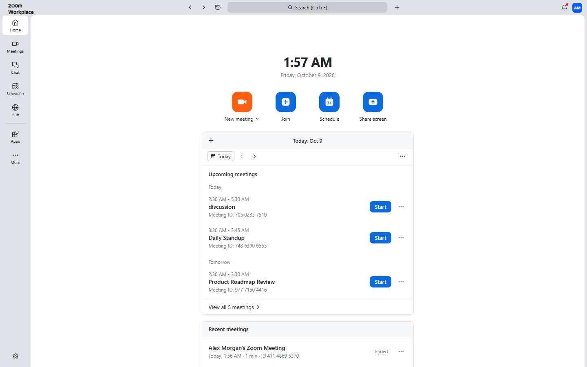
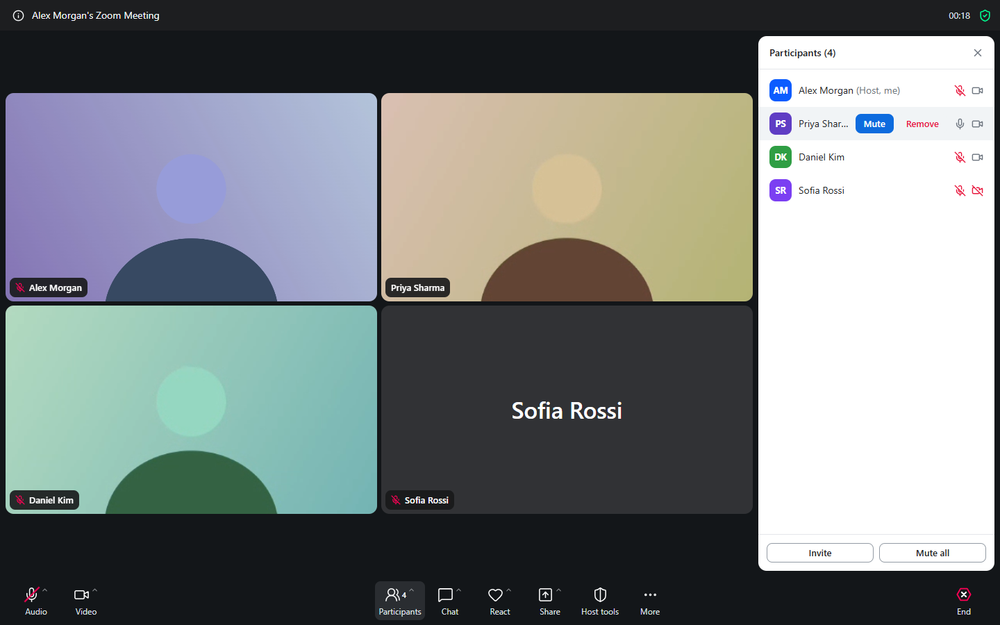
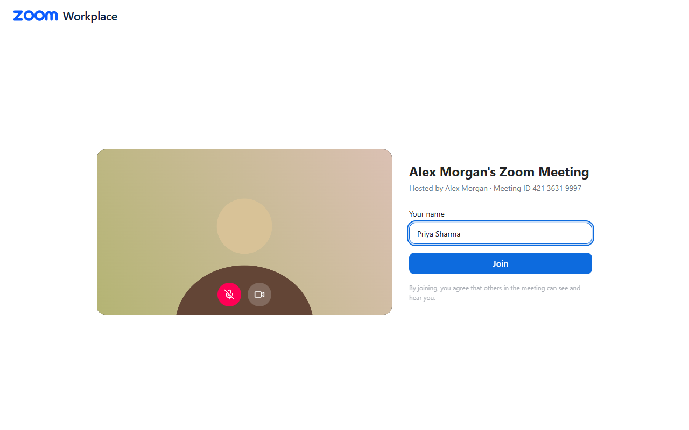
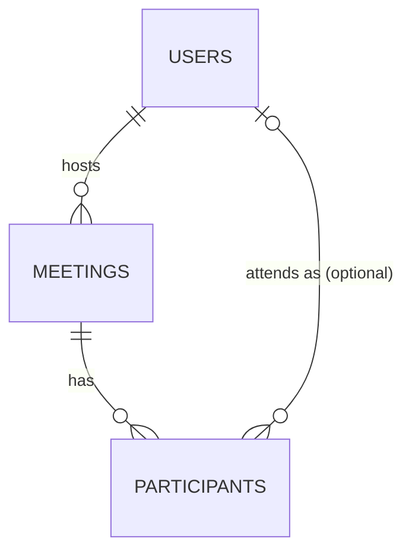

# Zoom Clone

A video conferencing web app modelled on Zoom: start an instant meeting, join
one by meeting ID or invite link, schedule meetings, and meet with live audio
and video, chat and host controls.

Built for the Scaler SDE Fullstack assignment.

| | |
|---|---|
| **Live app** | _add the Vercel URL after deploying_ |
| **API** | _add the Render URL after deploying_ |



| Meeting room with host controls | Pre-join screen |
|---|---|
|  |  |

## Features

### Core requirements

| Requirement | Where to see it |
|---|---|
| **Landing dashboard** with Zoom's look | Home: Zoom Workplace's top bar (search, notifications, profile menu) and navigation rail (settings at the bottom); clock; New meeting, Join, Schedule and Share screen tiles |
| Upcoming meetings section | The calendar card on Home, grouped by day, with Today / previous / next day controls; full list under Meetings > Upcoming |
| Recent meetings section | "Recent meetings" on Home; full list under Meetings > Previous |
| **Instant meeting**: unique ID, invite link, redirect to the room | New meeting creates an 11-digit meeting ID and a `/j/{id}` link, then opens the room |
| **Join** by meeting ID or invite link | The Join dialog accepts either; opening an invite link goes to a pre-join screen |
| Enter a display name before joining | Asked in the Join dialog and on the pre-join screen |
| Validate that the meeting exists | Unknown or ended meetings show an error instead of joining |
| **Schedule**: title, description, date and time, duration | The Schedule dialog |
| Auto-generated meeting link, stored in the database | Shown right after saving, with Copy invitation |
| Shown in Upcoming | Appears at once on Home and under Meetings |

### Bonus

- **Responsive design** for phone, tablet and desktop. On phones the tabs move
  to a bottom bar and the meeting panels open full screen.
- **Host controls**: mute all, mute one participant, remove a participant, end
  the meeting for everyone. The server enforces them.
- **Login/signup is not built.** The brief says to assume a default logged-in
  user, so that is what the app does. See [Assumptions](#assumptions).

### Beyond the brief

- Live audio and video between participants (WebRTC), in a gallery view that
  resizes to fit the window
- Screen sharing, in-meeting chat with an unread badge, emoji reactions
- Edit and delete scheduled meetings; copy the invitation or meeting ID
- Reconnects automatically after a network drop; a page refresh keeps your
  place in the meeting

## How closely it matches Zoom

The interface was built against Zoom's own material, not from memory:

| What | Compared with | How |
|---|---|---|
| Home screen layout: top bar, navigation rail, clock, action tiles, calendar card | The home-tab screenshot in Zoom's support article "Getting started with the Zoom Workplace desktop app" | Sizes and positions read off the screenshot; colours sampled from its pixels |
| Meeting toolbar, title bar, video tiles and name labels | The in-meeting screenshot in the same article | Colours sampled from its pixels; labels and order copied |
| Font, buttons, text fields and dialogs | The live Zoom web app at app.zoom.us | Values read from its stylesheet in a browser |

Measured values used in the app include the grey frame `#DFE2E7`, the tile
orange `#FF5F0F`, the button blue `#0D6BDE`, the meeting background `#131619`,
the in-meeting red `#FF0055`, 40px inputs with 12px corners, and Zoom's own
font stack (the system font: Segoe UI on Windows, SF Pro on macOS).

It is not pixel-identical. Known differences:

- **Icons and logo.** Zoom's icon set and wordmark are proprietary. The app
  uses an open-source icon set (Lucide), four hand-drawn tile glyphs and a
  wordmark drawn with simple strokes, so shapes are close but not the same.
- **Recent meetings card.** Zoom's home screen has no such card; it is here
  because the assignment asks for one on the dashboard.
- **Calendar card.** Zoom shows one day at a time from a connected calendar.
  Here the card lists upcoming meetings from the selected day onward, so a
  meeting scheduled for next week is visible without paging to it.
- **Join dialog.** Zoom's asks only for the meeting ID. This one also asks
  for a display name, which the assignment requires.
- **Left out.** The "My notes" tile, AI Companion, whiteboard, recording,
  breakout rooms, waiting room and the green outline around the person
  speaking.
- **Not compared.** Zoom's schedule form, its pre-join screen and its
  participants and chat panels are only visible after signing in or joining a
  real meeting, so those screens follow Zoom's general style rather than a
  measured reference. Zoom has no browser layout for phones (it has native
  apps), so the phone layout is this project's own adaptation.

## Tech stack

| Layer | Technology |
|---|---|
| Frontend | Next.js 16 (App Router), React 19, TypeScript, Tailwind CSS 4 |
| Backend | Python 3.13, FastAPI, SQLAlchemy 2, Pydantic 2 |
| Database | SQLite |
| Realtime | WebSockets (presence, chat, signalling) and WebRTC (audio, video) |
| Tests | pytest, Vitest |
| Tooling | Ruff, ESLint, GitHub Actions |

## Run it locally

You need **Python 3.11 or newer** and **Node.js 20 or newer**. Use two
terminals, one for each app.

### 1. Backend

```bash
cd backend
python -m venv .venv
```

Activate the virtual environment:

```bash
# Windows (PowerShell)
.venv\Scripts\Activate.ps1
```

```bash
# macOS or Linux
source .venv/bin/activate
```

Install the dependencies and start the server:

```bash
pip install -r requirements-dev.txt
uvicorn app.main:app --reload --port 8000
```

The API is now at http://localhost:8000 and its interactive documentation at
http://localhost:8000/docs. On first start it creates `backend/zoom.db` and
fills it with sample meetings.

### 2. Frontend

```bash
cd frontend
npm install
npm run dev
```

Open http://localhost:3000.

### Configuration

Both apps work locally without any configuration. To change something, copy
the example file and edit it.

| File | Variable | Default | Purpose |
|---|---|---|---|
| `backend/.env` | `FRONTEND_URL` | `http://localhost:3000` | Allowed browser origin (CORS) and the base of invite links |
| | `EXTRA_CORS_ORIGINS` | empty | More allowed origins, comma separated |
| | `CORS_ORIGIN_REGEX` | empty | Allowed origins by pattern, e.g. preview deployments |
| | `DATABASE_URL` | `backend/zoom.db` | Where the SQLite file lives |
| | `SEED_ON_STARTUP` | `true` | Insert sample data when the database is empty |
| `frontend/.env.local` | `NEXT_PUBLIC_API_URL` | `http://localhost:8000` | Where the backend is |

### Try a meeting with two people

1. On the dashboard, click **New meeting**. You are in the room as the host.
2. Click the green shield at the top left and copy the invite link.
3. Open the link in a **second browser window** (a private window works
   well). Enter a name and join.
4. You now see each other's video. Try chat, reactions, and the host's
   **Participants** panel: Mute all, Mute and Remove.

Two tabs on one computer share one microphone and speakers, so keep at least
one of them muted to avoid an echo.

### Reset the sample data

Stop the backend, delete `backend/zoom.db` and start it again.

## Tests and checks

```bash
cd backend
pytest
ruff check .
ruff format --check .
```

```bash
cd frontend
npm test
npm run lint
npm run typecheck
npm run build
```

The same checks run in GitHub Actions on every push
([`.github/workflows/ci.yml`](.github/workflows/ci.yml)).

## API

Base path: `/api/v1`. Full interactive documentation is at `/docs` on the
running backend.

| Method | Path | What it does |
|---|---|---|
| GET | `/users/me` | The logged-in (default) user |
| GET | `/meetings/upcoming` | Scheduled meetings that have not finished |
| GET | `/meetings/recent` | Past and instant meetings |
| POST | `/meetings/instant` | Create a meeting that starts now |
| POST | `/meetings` | Schedule a meeting |
| GET | `/meetings/{id}` | Look a meeting up; used to validate an ID |
| PATCH | `/meetings/{id}` | Edit a scheduled meeting |
| DELETE | `/meetings/{id}` | Delete a meeting |
| POST | `/meetings/{id}/start` | Enter as the host |
| POST | `/meetings/{id}/join` | Enter as a guest with a display name |
| WS | `/ws/meetings/{id}?token=...` | The live room |

`{id}` is the 11-digit meeting ID. It may be sent with or without spaces.

## Database

Three tables: `users`, `meetings` and `participants`.



- A **user** hosts many meetings.
- A **meeting** has a public 11-digit `code`, a `kind` (instant or scheduled),
  a `status` (scheduled, live or ended), its planned time and its actual start
  and end.
- A **participant** is one person's attendance in one meeting. `user_id` is
  empty for guests, who join with only a display name.

The full schema, the reasons behind it, and how the realtime and video parts
work are in [docs/ARCHITECTURE.md](docs/ARCHITECTURE.md).

## Project structure

```
backend/
  app/
    api/         REST routes and shared dependencies
    realtime/    WebSocket endpoint, event handlers, in-memory rooms
    services/    Business rules
    models/      Database tables
    schemas/     Request and response validation
    db/          Engine, sessions, seed data
    core/        Settings, errors, time helpers
  tests/
frontend/
  src/
    app/         Routes: dashboard, invite link, meeting room
    components/  ui, layout, dashboard, meeting
    hooks/       Stateful logic shared by components
    lib/         API client, formatting, WebSocket and WebRTC code
docs/            Architecture notes and screenshots
render.yaml      Backend deployment blueprint
```

## Deployment

The frontend goes to **Vercel** and the backend to **Render**. Deploy the
backend first, because the frontend needs its address.

### Backend on Render

1. In Render choose **New > Blueprint** and select this repository. Render
   reads [`render.yaml`](render.yaml).
2. When asked for `FRONTEND_URL`, enter a placeholder such as
   `http://localhost:3000`. You will correct it in step 5.
3. Wait for the deploy, then copy the service address, for example
   `https://zoom-clone-api.onrender.com`.

### Frontend on Vercel

4. In Vercel choose **Add New > Project**, import this repository, and set:
   - **Root Directory**: `frontend`
   - **Environment variable** `NEXT_PUBLIC_API_URL`: the Render address from
     step 3, with no slash at the end

   Deploy, then copy the Vercel address.
5. Back in Render, open the service's **Environment** tab, set `FRONTEND_URL`
   to the Vercel address (no slash at the end) and save. Render redeploys.

### Things to know about the free tiers

- Render's free service **sleeps after 15 minutes without traffic**. The next
  visit takes up to a minute while it wakes; the dashboard shows a notice.
- Render's free disk is **wiped on every deploy and restart**. The app
  recreates the database and sample data on startup, so meetings you created
  earlier are gone after a restart. A paid disk, or a hosted database, would
  keep them.

## Assumptions

- **One default user is logged in** (Alex Morgan), as the brief specifies.
  Every visitor to the dashboard is that user.
- **Host or guest is decided by how you enter.** Starting a meeting from the
  dashboard makes you its host. Joining through the Join dialog or an invite
  link makes you a guest, even in the same browser. This is what lets one
  person demonstrate host controls with two windows.
- **Guests need no account**, only a display name.
- **People can join a scheduled meeting before the host** starts it, as long
  as it has not ended.
- **An instant meeting ends** one minute after the last person leaves. A
  scheduled meeting stays open until its host ends it.
- **Times are stored in UTC** and shown in each viewer's own timezone.
- **Chat and reactions are not saved**; they last as long as the meeting.
- **Meeting passcodes and waiting rooms are out of scope.**
- Navbar items that belong to other Zoom products (Team Chat, Contacts,
  Settings, the profile menu) are placeholders, as the brief asks.

## Known limitations

- **Video is peer to peer.** That suits small meetings; it has been tested
  with three participants. Each extra person adds an upload for everyone
  else, which is why Zoom uses media servers for large meetings.
- **No TURN server.** A public STUN server is enough for most home and office
  networks, but two people who are both behind strict corporate firewalls may
  not see each other's video. Presence, chat and host controls still work.
- **The backend runs as one process**, because live rooms are held in memory.
  Running several would need a shared message broker such as Redis.
- **The session token travels in the WebSocket URL**, because browsers cannot
  set headers on WebSocket connections. It is a random, single-meeting token,
  not a password, but URLs can end up in server logs.

## Use of AI tools

The brief allows AI assistance. This project was built with Claude Code, with
the commits co-authored accordingly. The design decisions are explained in
[docs/ARCHITECTURE.md](docs/ARCHITECTURE.md).
