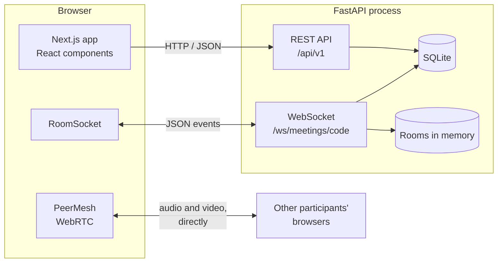
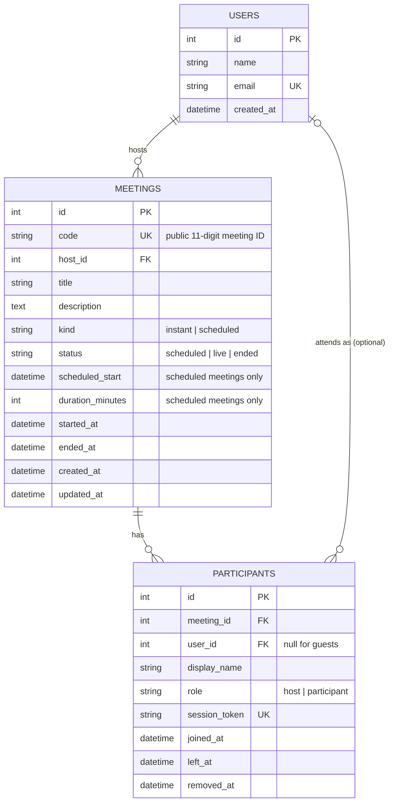
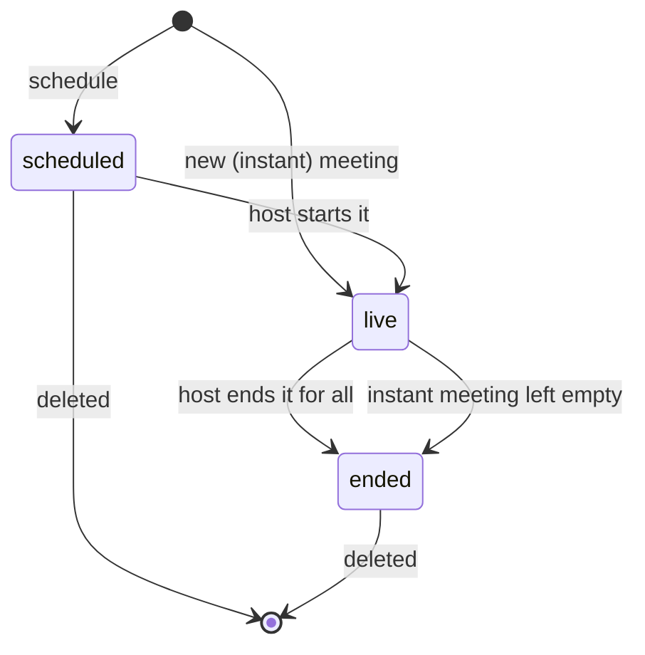
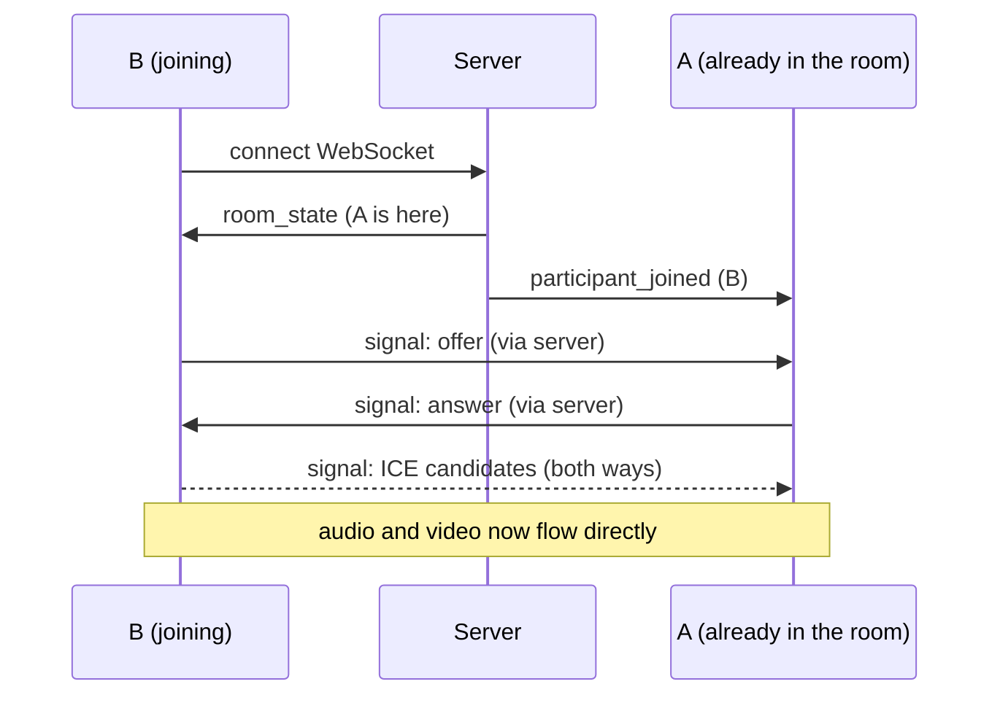

# Architecture

How the Zoom clone is put together, and why. Read this alongside the code:
each section names the files it describes.

## The big picture



There are three kinds of traffic:

| Traffic | Carries | Why this transport |
|---|---|---|
| REST over HTTP | Creating, listing, scheduling, joining | Request and response; easy to test and cache |
| WebSocket | Who is in the room, chat, mute state, host actions, WebRTC handshakes | The server must push events to browsers at any moment |
| WebRTC (peer to peer) | Audio and video | Media goes straight between browsers, so the server never handles video |

## Backend

`backend/app` is split into layers. Each layer only calls the one below it.

```
api/routes/     HTTP endpoints. Read the request, call a service, shape the response.
realtime/       The WebSocket endpoint, its event handlers and the room registry.
services/       The rules: what makes a meeting upcoming, who may start it, and so on.
models/         SQLAlchemy tables.
schemas/        Pydantic request and response shapes (validation lives here).
db/             Engine, session, shared column types, seed data.
core/           Settings, domain errors, time helpers.
```

Decisions worth knowing:

- **Thin routes, rules in services.** `api/routes/meetings.py` has no `if`
  statements about business rules. `services/meeting_service.py` can be tested
  and reused (the WebSocket layer calls it too) without HTTP.
- **Domain errors carry their HTTP status.** Services raise errors such as
  `MeetingNotFoundError` from `core/exceptions.py`. One handler in `main.py`
  converts any of them to `{"detail": "..."}`, the same shape FastAPI uses for
  its own errors, so the frontend parses one format.
- **One place decides who the user is.** `api/deps.py::get_current_user`
  returns the default user. Adding real login later means changing that one
  function; no route changes.
- **All times are UTC.** `db/base.py::UTCDateTime` converts on the way into
  SQLite and tags values as UTC on the way out. The API rejects timestamps
  that have no timezone. The browser converts to local time for display.
- **The database rebuilds itself.** On startup `main.py` creates missing
  tables and seeds sample data if there are no meetings. Free hosting wipes the
  disk on each deploy, so this keeps the demo from ever being empty.

### Database schema



Why it is shaped this way:

- **`meetings.code` is separate from `meetings.id`.** The code is what people
  type and share. Keeping the numeric primary key out of links means row
  counts and neighbouring meetings cannot be guessed from a link. Codes are
  generated with `secrets`, not `random`, so they are not predictable.
- **`participants.user_id` is nullable.** Guests join from a link with only a
  display name and have no account. A participant row is one attendance: it
  records who came, as what role, and when they joined and left.
- **`participants.session_token`** is a random secret given to the browser on
  join. It is how the WebSocket knows who is connecting, since guests cannot
  log in.
- **`removed_at`** stops someone the host removed from reconnecting with the
  same session.
- **Planned and actual times are separate columns.** `scheduled_start` and
  `duration_minutes` are the plan; `started_at` and `ended_at` are what
  happened. The "Recent" list shows the real length of a meeting.
- **Microphone and camera state are not stored.** They change many times a
  minute and mean nothing after the meeting, so they live in memory.
- **Constraints back up the code.** Enums are `VARCHAR` with `CHECK`
  constraints (SQLite has no enum type); a `CHECK` makes sure a scheduled
  meeting has a start and a duration; deleting a meeting cascades to its
  participants; foreign keys are switched on for every connection because
  SQLite ignores them by default.
- **Indexes match the queries.** Unique indexes on `code`, `email` and
  `session_token` serve the lookups; `(host_id, status)` serves the dashboard
  lists.

### Meeting lifecycle



A scheduled meeting counts as **upcoming** until its planned end time passes
or the host ends it. Everything else is **recent**.

### Who is the host?

The assignment assumes one logged-in user, so there is no login to tell people
apart. The entry point decides the role instead:

- **Start** (the dashboard's New meeting or Start buttons) calls
  `POST /meetings/{code}/start`. It requires the logged-in user to own the
  meeting and creates a `host` participant.
- **Join** (the invite link or the Join dialog) calls
  `POST /meetings/{code}/join` and always creates an ordinary `participant`.

The server checks the role again on every host-only WebSocket message
(`realtime/events.py::host_only`), because a browser can send anything.

## Realtime layer

Files: `backend/app/realtime/`, `frontend/src/lib/realtime/`,
`frontend/src/hooks/useMeetingRoom.ts`.

Each browser in a meeting opens one WebSocket:
`/ws/meetings/{code}?token={session_token}`. Every message is JSON with a
`type`.

| Browser sends | Server sends | Purpose |
|---|---|---|
| (on connect) | `room_state` to the newcomer, `participant_joined` to the others | Presence |
| (on disconnect) | `participant_left` | Presence |
| `media_state` | `participant_updated` | Mute and camera icons |
| `chat` | `chat` | Meeting chat |
| `reaction` | `reaction` | Emoji reactions |
| `signal` (to one person) | `signal` | WebRTC handshake |
| `mute_all`, `mute_participant` (host) | `force_mute` to the target, `participant_updated` | Host controls |
| `remove_participant` (host) | `removed` to the target, `participant_left` | Host controls |
| `end_meeting` (host) | `meeting_ended` to everyone | Host controls |

The server closes a socket with a specific code when the session is over
(removed, meeting ended, replaced by another tab), and the browser shows the
matching full-page notice. Any other close is treated as a network drop and
the browser reconnects, up to five times.

Live rooms are a dictionary in the server process
(`realtime/rooms.py::RoomRegistry`). **This is why the backend runs as a single
process.** To scale beyond one process the registry would move to Redis
pub/sub so that processes can relay events to each other.

## Audio and video (WebRTC)

File: `frontend/src/lib/realtime/peerMesh.ts`.

Every participant holds a direct connection to every other participant (a
"mesh"). Connecting two browsers takes a short handshake, relayed by the
WebSocket:



- **The newcomer always calls.** Two browsers therefore never call each other
  at the same moment, which avoids a whole class of handshake conflicts.
- **Audio and video channels are always created**, even with the camera off.
  Turning the camera on, or switching to screen share, then only swaps the
  track with `replaceTrack`; no second handshake is needed.
- **A public STUN server** lets browsers behind home routers find each other.

Trade-off: in a mesh each person uploads their video once per other
participant, so it suits small meetings. Large meetings need a media server
(an SFU), which is what Zoom itself uses.

## Frontend

```
src/app/                 Routes (Next.js App Router)
  (dashboard)/           Home and Meetings, sharing the navbar and data
  j/[code]/              The invite link: pre-join screen
  meeting/[code]/        The meeting room
src/components/
  ui/                    Generic pieces: Button, Modal, Popover, Toast...
  layout/                The app frame: top bar and navigation rail
  dashboard/             Tiles, lists, dialogs
  meeting/               Room, toolbar, panels, video tiles
src/hooks/               Stateful logic shared by components
src/lib/                 Plain TypeScript with no React: API client, formatting, WebRTC
```

- **The look is measured, not guessed.** Colours, sizes and the font stack in
  `app/globals.css` were taken from Zoom's own screenshots and web app; the
  README lists the sources and the known differences.
- **It behaves as a single page application.** Pages fetch from the API in the
  browser and move between routes without reloading. The meeting screens are
  loaded with `ssr: false` because they need the camera, `sessionStorage` and
  WebSockets, which only exist in a browser.
- **All HTTP calls go through `lib/api.ts`**, which turns every failure into an
  `ApiError` with a message that can be shown to the user.
- **Logic that is not about React is not in React.** `lib/` holds plain
  functions and classes (`PeerMesh`, `RoomSocket`, `LocalDevices`,
  `computeGridLayout`), which makes them unit-testable. Hooks connect them to
  components.
- **Devices are an external system.** `LocalDevices` owns the camera and
  microphone tracks; React subscribes with `useSyncExternalStore` rather than
  copying browser objects into state.
- **The dashboard shares one data source.** `DashboardProvider` loads the user
  and both meeting lists once and owns the dialogs, so Home and Meetings stay
  in sync after every change.
- **The session is per tab.** `lib/session.ts` keeps it in `sessionStorage`, so
  a refresh keeps your place in the meeting, and a second tab opened from the
  invite link is a separate participant.

## Testing

| Suite | Where | What it covers |
|---|---|---|
| Backend (pytest) | `backend/tests` | REST endpoints, validation, the WebSocket protocol including host controls, seed data |
| Frontend (Vitest) | `frontend/src/lib/*.test.ts` | Meeting ID parsing, date formatting, gallery layout |
| CI (GitHub Actions) | `.github/workflows/ci.yml` | Lint, type-check, tests and a production build on every push |

Backend tests run against an in-memory SQLite database, a fresh one per test.
